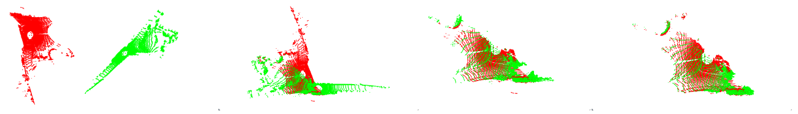

# Cluster-Based Inlier Filtering and Coarse to Fine Inlier Discovery
## Introduction
This project aim to introduce a plug-and-play module, to filter out outliers, this process is crucial for downstream task such as 3D reconstruction, autonomous vehicles, and SLAM. 
We focus on improving accuracy and computational efficiency by employing cluster-based inlier masking coupled with a coarse-to-fine inlier discovery process.
## Contributions
* Cluster-Based Inlier Filtering: This innovative approach clusters the point clouds and selectively filters out inliers, providing a scalable solution to efficiently handle large datasets, resolve the problem of losing too much information when down-sampling.
* Coarse to Fine Inlier Discovery: By refining inliers iteratively within these clusters, we enhance the robustness and precision of the registration process. This method leverages rotationally invariant features to adapt to various environmental dynamics.
* Iterative Approach or Rotationally Invariant: Whether the two point clouds are placed anywhere, even at opposite ends of the world, we should obtain the same inlier part. This requires us to achieve it iteratively, or we could introduce rotational invariance.
## Temporary Results

In the image on the far left, the red represents the source (src) point cloud and the green represents the target (tgt) point cloud. The second image from the left shows the point clouds after applying the ground truth (gt) transformation. The third image from the left displays our predicted inlier mask, and the fourth image on the far left shows the ground truth inlier mask.